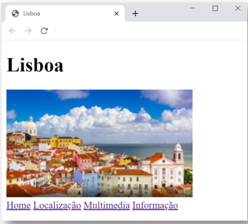
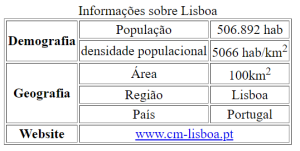
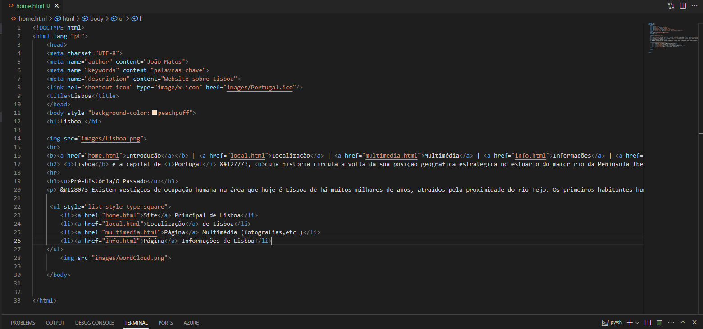
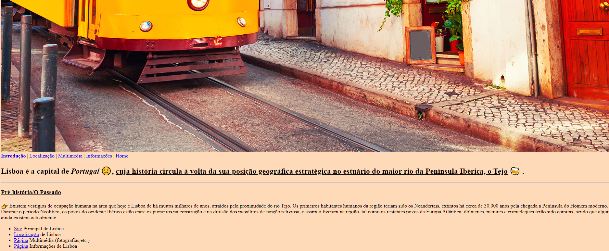
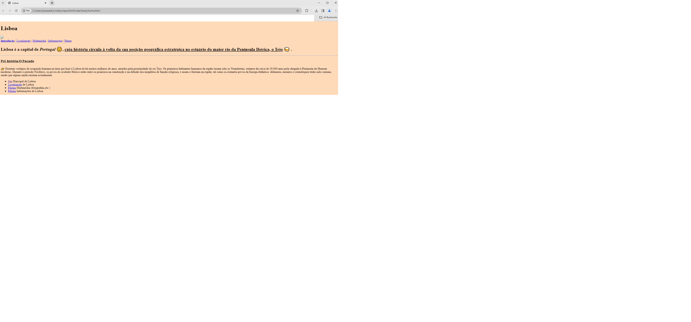

**Escola do Comércio de Lisboa**
 
# Programação Web - Laboratório 2: <br>*Explorando o HTML com o meu primeiro website*

## Objetivo
* Neste laboratório criará um website sobre uma cidade à sua escolha, onde irá aplicar os conceitos aprendidos sobre HTML adquiridos esta semana.

## Recomendações
* Leia o enunciado todo com atenção antes de o começar a resolver para entender o que fará.
* Execute com atenção cada passo, certificando-se que implementa todos os detalhes. Contém todos os detalhes para a criação do website.

## Pré-requisitos
* Deverá ter instalado o VsCode no seu computador.

# 1. Estruturação da sua pasta

1.1 A estrutura da sua pasta `lab2` deverá ser como em baixo:

```
+-- lab2
|   +-- home.html
|   +-- info.html
|   +-- local.html
|   +-- multimedia.html
|   +-- images
    |   +-- lisbon.png
        +-- ...
```

# 2. Página Web 

Fará neste laboratório 2 um website sobre uma cidade do mundo à sua escolha que goste. Deverá congregar várias informações sobre esta conforme indicado ao longo do laboratório. 

Na pasta `lab2` crie o ficheiro `home.html`, inserindo as partes elementares:

```html
<!DOCTYPE html>
<html lang="pt">
    <head>
    </head>
    <body>
    </body>
</html>
```

1. Na secção <head> especifique como título (etiqueta <title>) para a barra do navegador o nome da cidade. 
2. Especifique também os seguintes metadados:
    1. codificação UTF-8. 
    2. nome do autor do site, descrição do conteudo do site, e palavras chave: 
        * `<meta name="author" content="Ana Maria">`
        * `<meta name="keywords" content="palavras chave">`
        * `<meta name="description" content="Website sobre Lisboa">`

3. Crie um icon para o seu website. Para tal:
    1. Escolha uma imagem que converterá para icon (extensão .ico) recorrendo a uma aplicação web (e.g., https://www.favicon-generator.org/). Alternativamente, pode escolher um icon aqui https://www.iconspedia.com/.
    2. Guarde o icon numa nova pasta `images`, dentro de `lab2`. Garanta que tem a extensão `.ico`
    3. Insira um link para o icon no head da seguinte forma `< link rel="shortcut icon" type="image/x-icon" href="images/favicon.ico"/>`
    4. Poderá observar que, pelo facto de o icon estar na pasta `imagens`, tem sempre que especificar no href o caminho relativo para o local onde se encontra a imagem, o nome da pasta imagens (href="images/imagem.ico”).

4. Explore o site https://www.rapidtables.com/web/color/, onde para cada cor existe uma palete de intensidades que pode escolher. Neste site, escolha uma cor clara para o fundo da sua página, e especifique-a na etiqueta `body` da seguinte forma: `<body style="background-color:plum">` 

# 3. Criação do cabeçalho

Crie agora o cabeçalho do seu website. Terá o nome da Cidade, uma imagem e o menu, ficando da seguinte forma:



Para, tal, siga os seguintes passos: 
1.	No body, insira um elemento `h1` com o nome da cidade.
2.	Na linha seguinte insira uma imagem da cidade a seu gosto. Redimensione a imagem para que tenha 300px de largura.No Paint existe uma opção resize que lhe permite escolher o número de pixels que pretende que tenha de largura. Respeite a proporção da imagem, sem a deformar! Guarde a imagem numa nova pasta `images`. Insira a imagem usando a etiqueta `img`. 
3.	Deverá inserir, depois da imagem, uma quebra de linha, `br`, pois o elemento `img` não introduz uma quebra.
4. Irá agora criar o menu. Para tal:
    1. Crie cinco etiquetas de hiperlink `a`, tendo como conteúdo o nome das páginas do seu site (Introdução, Localização, Multimédia, Informações, Home), estando os elementos separados pelo carater `|`. 
    2. Use como valor para o atributo `href` as seguintes páginas:
        1. `home.html` para Introdução 
        2. `local.html` para Localização
        3. `multimedia.html` para Multimédia
        4. `info.html` para Informações
        5. `../home.html` para Home (indice geral dos laboratórios)

# 4. Criação das páginas do website

De seguida iremos criar as páginas do seu website que estarão interligadas.
1.	Crie 4 copias do ficheiro home.html que criou. 
2.	Altere os nomes dos ficheiros para ter um de cada, com os seguintes nomes: home.html, local.html, multimedia.html, info.html (atenção que os nomes dos ficheiros HTML  deverão estar em minúsculas, sem espaços, acentos ou carateres especiais)
3.	Em cada ficheiro, no menu ponha a negrito a palavra a que corresponde a página.
4.	Abra o ficheiro home, e experimente se os hiperlinks funcionam. 
Tem agora criado o seu website! Agora irá preencher cada página com conteúdos.

# 5. Página Introdução

Na pagina `home.html` insira, no body, por debaixo do menu:
1. Um elemento `h2` com a palavra Introdução.
2. Escreva um parágrafo sobre a cidade.
3. Pequena história divertida:  
    1. Conte uma pequena história divertida apenas com emojis 😉, sobre a :cityscape: que escolheu. Explore emojis, premindo nas teclas `🙂Windows + .`, ou pesquise na Internet em [emojipedia](https://emojipedia.org/), [carateres especiais UTF-8](https://www.w3schools.com/charsets/ref_html_utf8.asp), ou [W3Schools](https://www.w3schools.com/charsets/ref_emoji.asp). 
    2. Coloque uma barra horizontal de separação `hr` 
    3. Conte a história por palavras suas, mas usando marcadores de estilo (veja slides 17 e 18 da aula) e organizacionais para formatar cada palavra diferentemente 😬!
    4. Coloque uma barra horizontal de separação `hr` 
    5. Conte a história por palavras suas sem formatação. 
4. De seguida, num novo parágrafo apresente o seu website, criando uma lista não numerada onde apresenta em poucas palavras cada uma das páginas do seu website, incluindo um link para essa página numa das palavras. Escolha um marcador de lista especial (um quadrado por exemplo).
5. Crie de seguida uma [wordcloud](https://www.wordclouds.com/) com base em palavras que associa à cidade. Adicione as palaras em "wordlist" (apague primeiro as existentes). Ponha peso 10 no nome da cidade para que esta fique com maior destaque. Pode escolher uma forma (shape), fonte (font), cores (use um fundo branco). Descarregue a imagem, e formate-a com o Paint por forma a que tenha largura de 300px como a fotografia da cidade. Isira-a por debaixo da lista.

# 6. Página Localização

Na página `local.html`:
1. Por baixo do menu, insira um elemento `h2` com a palavra Localização.
2. Insira um pequeno parágrafo que descreva a localização da ciadade (continente, país), assim como algumas informações geográficas destas.
3.	Insira por baixo um mapa do Google Maps do lugar. Para tal: 
    a. procure o lugar no website www.google.pt/maps
    b. Faça um zoom que considera apropriado
    c. clique em “partilhar” e na opção “incorporar mapa” 
    d. Selecione tamanho pequeno
    e. copie o código HTML resultante, `<iframe src=… >`
    f. insira esse código HTML na sua pagina HTML
    g. acerte a dimensão da janela.


# 5. Página Multimédia

Na página `multimedia.html` crie:
1. Um elemento `h2` com a palavra Multimédia.
2.	Um elemento `h3` intitulado Fotografias. Escolha no Google pelo menos 3 fotografias emblemáticas do lugar que escolheu.  	 	 
3. Utilize a aplicação Paint.Net para gravar duas versões das fotografias em tamanhos definidos (o comando Ctrl+R ou Ctrl+W permite abrir um interface que permite configurar o tamanho das imagens, consoante a aplicação; deverá igualmente recortar as fotografias com o comando "crop", para as proporções indicadas): 
    1. Grande, de 600x400 pixels de largura. Altere o nome, incluindo _grande no fim (e.g., lisboa_grande.jpg).
    2. Pequena, de 120x80 pixels de largura. Altere o nome, incluindo _pequena (e.g., lisboa_pequena.jpg).
    3. Guarde as 6 fotografias na pasta `imagens`. 
    4. Insira na página HTML as imagens de 100px de largura,dentro de um único parágrafo, uma ao lado da outra. Especifique o campo `alt`. Aninhe o elemento `img` dentro de um hiperlink `a`, com hiperligação para a fotografia grande correspondente e com o atributo `target="foto"`.
 ```bash
 <a href=""></a>
 ```
    5. Crie um elemento `iframe` 800x600 com `name="foto"`, para visualizar em grande a fotografia que for clicada. Especifique na iframe,no atributo `src`, uma das imagens, para que apareça
    6. antes das fotografias, escreva um texto que apresente as fotografias em baixo.
4. Um elemento `h3` intitulado Vídeo. Pesquise no Youtube por um video sobre a cidade escolhida e insira-o na sua página recorrendo à opção "partilhar" e escolhendo "embeded".
5.	Um elemento `h3` intitulado Poema. Escolha um poema que de alguma forma associa ao lugar escolhido. Escreva, usando tamanhos diferentes, o título numa linha, o nome do poeta na seguinte, seguindo-se o poema, em itálico. Todo o texto deverá estar centrado. 
6. Defina identificadores `id` em cada título `h3`. Por baixo do elemento `h3` Multimédia, coloque hiperlinks "âncora" para cada uma das secções desta página (fotografias, video, poema). 


# 6. Página Informações

Na página `info.html`:
1.	Um elemento `h3` com a palavra Informações.
2.	Crie esta página com dados à sua escolha sobre a cidade escolhida. Uma sugestão é ir à wikipedia e extrair alguns dados sobre a mesma.
3. (Opcional)
3.1 Se quiser, pode também criar uma tabela com dados à sua escolha sobre a cidade escolhida. Como podemos verificar na tabela em baixo. (por exemplo demografia, geografia, história, etc). Exemplo de tabela:



# 7. Exemplo de código da página principal (home.html)

Code:



Visualização desse mesmo code no Chrome:



 
 # Fim
 
Esperamos que tenha gostado de aplicar os conhecimentos de HTML fazendo este website sobre uma cidade à sua escolha &#127760;!
